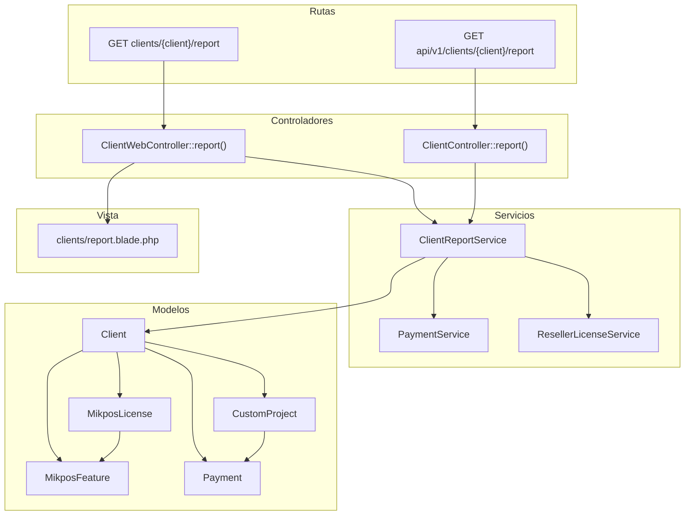
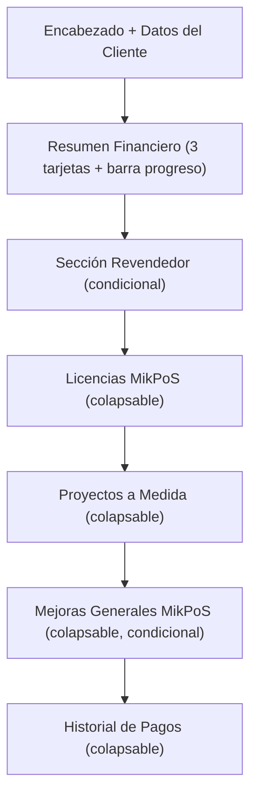

# Documento de Diseño — Reporte Detallado por Cliente

## Visión General

Este diseño describe la implementación de una vista de reporte detallado por cliente que consolida toda la información financiera y operativa en una sola página. El reporte se compone de un controlador web (`ClientWebController::report`), un endpoint API (`ClientController::report`), un servicio dedicado (`ClientReportService`) que centraliza la lógica de agregación de datos, y una vista Blade (`clients/report.blade.php`) con secciones colapsables vía Alpine.js y optimización para impresión con `@media print`.

El diseño reutiliza los modelos, enums y servicios existentes (`PaymentService::getFinancialSummary`, `ResellerLicenseService::getResellerSummary`) y sigue el patrón de controladores duales (Web + API) establecido en el proyecto.

## Arquitectura



El flujo es:
1. La ruta invoca el controlador correspondiente (Web o API).
2. El controlador inyecta `ClientReportService` y llama a `generateReport(Client $client)`.
3. El servicio orquesta la carga eager de relaciones, delega cálculos financieros a `PaymentService` y resumen de revendedor a `ResellerLicenseService`.
4. El controlador web pasa los datos a la vista Blade; el controlador API retorna JSON.

## Componentes e Interfaces

### 1. ClientReportService

Nuevo servicio en `app/Services/ClientReportService.php` que centraliza la lógica de agregación del reporte.

```php
final class ClientReportService
{
    public function __construct(
        private readonly PaymentService $paymentService,
        private readonly ResellerLicenseService $resellerLicenseService,
    ) {}

    /**
     * Genera todos los datos del reporte para un cliente.
     *
     * @return array<string, mixed>
     */
    public function generateReport(Client $client): array;
}
```

El método `generateReport` retorna un array asociativo con las siguientes claves:

| Clave | Tipo | Descripción |
|---|---|---|
| `client` | `Client` | Cliente con relaciones eager-loaded |
| `financial_summary` | `array` | Resultado de `PaymentService::getFinancialSummary()` |
| `licenses` | `Collection<MikposLicense>` | Licencias con features anidadas |
| `active_monthly_total` | `float` | Subtotal mensual de licencias activas no gratuitas |
| `projects` | `Collection<CustomProject>` | Proyectos con payments anidados |
| `orphan_features` | `Collection<MikposFeature>` | Mejoras sin licencia asociada |
| `payments_by_category` | `array` | Pagos agrupados con subtotales por categoría |
| `reseller_summary` | `array\|null` | Resumen de revendedor (null si es cliente final) |
| `generated_at` | `string` | Fecha/hora de generación en formato `dd/mm/YYYY HH:mm` |

#### Responsabilidades internas:

- **Eager loading**: Carga `mikposLicenses.features`, `customProjects.payments`, `payments.customProject`, `mikposFeatures` en una sola llamada.
- **Licencias activas**: Filtra licencias activas no gratuitas y suma `monthly_rate` para el subtotal mensual recurrente.
- **Mejoras huérfanas**: Filtra `mikposFeatures` donde `mikpos_license_id` es null.
- **Pagos por categoría**: Agrupa pagos por `category` y calcula subtotales por grupo.
- **Resumen revendedor**: Solo invoca `ResellerLicenseService::getResellerSummary()` si `client_type === ClientType::Reseller`.

### 2. ClientWebController (método report)

Nuevo método en el controlador web existente:

```php
public function report(Client $client): View
{
    $reportData = $this->clientReportService->generateReport($client);
    return view('clients.report', $reportData);
}
```

El controlador inyecta `ClientReportService` via constructor. Se agrega la ruta `clients/{client}/report` en `routes/web.php` con nombre `clients.report`.

### 3. ClientController (método report para API)

Nuevo método en el controlador API existente:

```php
public function report(Client $client): JsonResponse
{
    $reportData = $this->clientReportService->generateReport($client);
    return response()->json([
        'success' => true,
        'data'    => $reportData,
        'message' => 'Reporte generado exitosamente.',
    ]);
}
```

Se agrega la ruta `api/v1/clients/{client}/report` en `routes/api.php` con nombre `api.v1.clients.report`.

### 4. Vista Blade: clients/report.blade.php

La vista utiliza `<x-app-layout>` y se organiza en las siguientes secciones:



Cada sección colapsable usa Alpine.js con el patrón:
```html
<div x-data="{ open: false }">
    <button @click="open = !open">...</button>
    <div x-show="open" x-collapse>...</div>
</div>
```

#### Estilos de impresión (`@media print`):
- Ocultar sidebar, header móvil, botones de acción.
- Forzar `display: block` en todas las secciones colapsables (ignorar `x-show`).
- Mostrar logo MikSoftware y fecha de generación en encabezado de impresión.
- Evitar saltos de página dentro de tarjetas y tablas (`break-inside: avoid`).

#### Indicadores de color por estado:
| Estado | Color Tailwind |
|---|---|
| Activa / Completado | `text-emerald-600`, `bg-emerald-50` |
| Pendiente | `text-yellow-600`, `bg-yellow-50` |
| En Progreso | `text-blue-600`, `bg-blue-50` |
| Cancelado / Retrasado | `text-red-600`, `bg-red-50` |
| Promoción Gratuita | `text-accent`, `bg-accent/10` |

### 5. Modificaciones a vistas existentes

- **`clients/show.blade.php`**: Agregar botón "Ver Reporte Detallado" que enlace a `route('clients.report', $client)`.
- **`clients/statement.blade.php`**: Agregar enlace de navegación "Ver Reporte Completo" en el encabezado.

